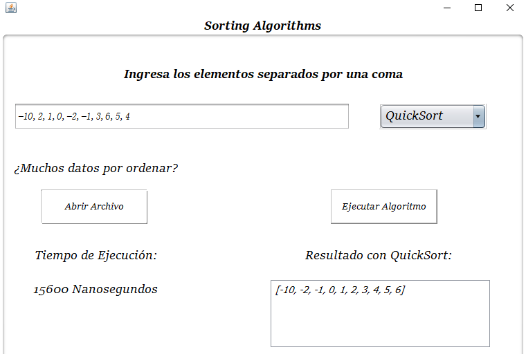

# What was the goal of this project?
In order to undersand somthing I need to do a project to maintain the idea of how an algorithm works. 
I've been using Python for a long time and I tried to do my best with Java, there're so many things that I would like to learn about this lenguage.

# How it works?
The user just need to put the numbers in the texfield(separated for a comma), choose the algorithm and press the button "Ejecutar Algoritmo".
In case the size of items to be sorted is very large the user will have to click the button "Abrir Archivo". It only works with .txt files.

# Preview

